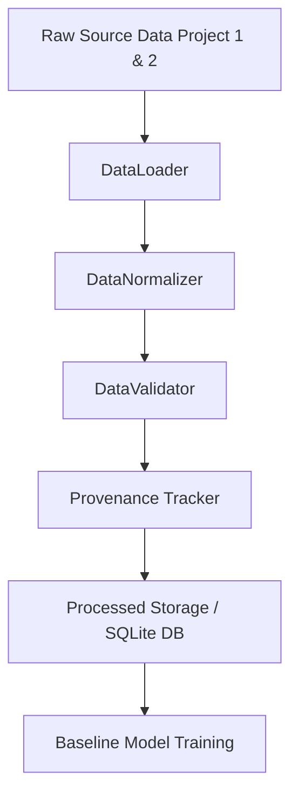

# AeroSense Delhi - Architecture

This document describes the architectural foundation for the AeroSense Delhi AI forecasting system.

## Stage 1 Foundation

The initial stage establishes the core project structure, database schemas, and data processing capabilities needed before AI model development begins.

### Components

1. **FastAPI Backend (`backend/app/main.py`)**: The primary web server. Exposes REST API endpoints.
2. **Configuration (`backend/app/config/settings.py`)**: Environment-based config via `pydantic-settings`.
3. **Database (`backend/app/models/database.py`)**: SQLite used for local development via SQLAlchemy. 
4. **Data Ingestion (`backend/app/data/loaders.py`)**: Utilities for loading raw data (CSV, XLSX).
5. **Data Normalization (`backend/app/data/normalizer.py`)**: Harmonizes column names, specifically standardizing variants of PM2.5, PM10, etc., into a uniform schema.
6. **Data Validation (`backend/app/data/validator.py`)**: Flags missing data, time gaps, negative pollutants, and extreme weather values.
7. **Provenance Tracking (`backend/app/data/provenance.py`)**: Tracks dataset lineage, versions, and origins.
8. **Baseline Model Interface (`backend/app/models/base_model.py`)**: Abstract base class (`fit`, `predict`, `evaluate`, `save`, `load`) ensuring all future forecasting models adhere to a standard contract.

### Data Flow

### Next Steps (Stage 2+)
- Plume Simulator
- Scenario Lab API
- 72-Hour Advanced Forecasting Model
